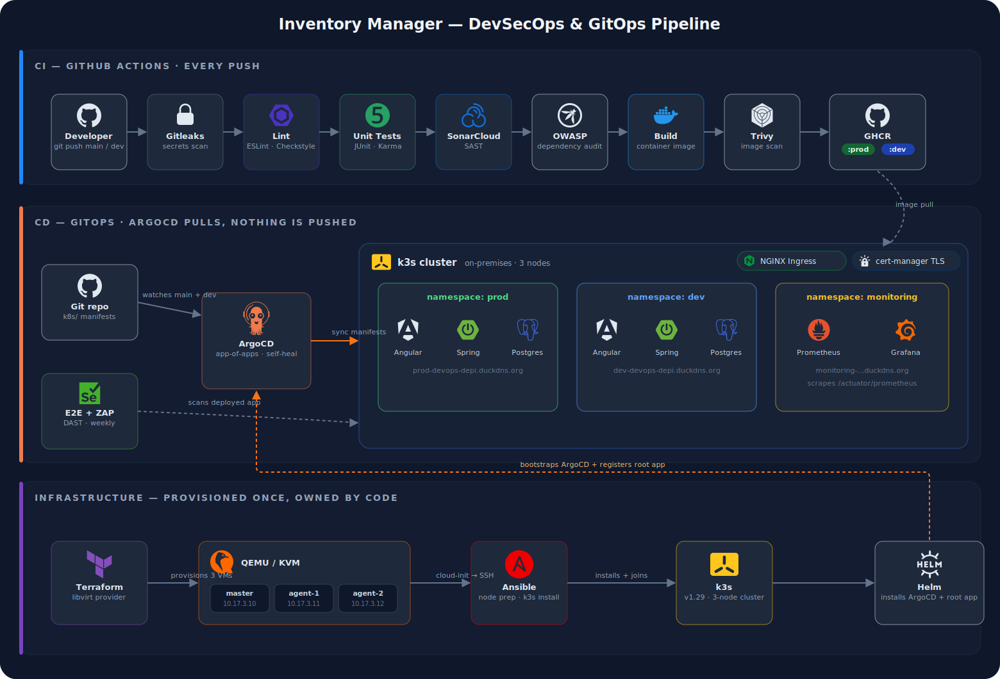

# Automated DevOps Deployment Pipeline Using GitHub Actions, Terraform, Ansible, Kubernetes, and Prometheus

> **Digital Egypt Pioneers Initiative (DEPI)**

| | |
| --- | --- |
| **Instructor** | Eng. Mohamed Atef |
| **Group** | GIZ4_SWD1_S1 |
| **Repo** | [github.com/Mohammed-Eissa/gitops-terraform-kubernates](https://github.com/Mohammed-Eissa/gitops-terraform-kubernates) |

## Forks

- [ToYoNiX/gitops-terraform-kubernates](https://github.com/ToYoNiX/gitops-terraform-kubernates)
- [AdhamZahran158/gitops-terraform-kubernates-monitoring](https://github.com/AdhamZahran158/gitops-terraform-kubernates-monitoring/tree/monitoring)
- [amatter17/gitops-terraform-kubernates](https://github.com/amatter17/gitops-terraform-kubernates/tree/main)

---

## Team

| Name | ID | Email |
| --- | --- | --- |
| Assem Mohamed Saad *(Leader)* | 21127219 | <toyonix.assemmohamed.2005@gmail.com> |
| Abdulrahman Aymen Mohamed | 21122155 | <abdulrahmanaymen90@gmail.com> |
| Khaled Mohamed Sayed | 21131090 | <khaledkomy260@gmail.com> |
| Mohamed Mahmoud Sayed | 21039179 | <mohamedeissa615@gmail.com> |
| Adam Kamal Metwaly | 21125121 | <adaam.kammal@gmail.com> |
| Adham Alaa Abdulraheem | 21010130 | <Adhamzahranil123@gmail.com> |
| Ahmed Mohamed Abdelaziz Matter | 21008261 | <amatter705@gmail.com> |

---

## Project Overview

This project delivers a **fully automated GitOps pipeline** for an Inventory Manager web application. The team owns the entire engineering layer beneath the application — infrastructure provisioning, containerisation, CI/CD, orchestration, security scanning, and monitoring — demonstrating end-to-end modern DevOps practices.

The application is a full-stack Inventory Manager built in-house:

- **Frontend** — Angular 17 + Angular Material served via Nginx
- **Backend** — Spring Boot 3.2 REST API (Java 17) with JWT authentication
- **Database** — PostgreSQL 15

Everything lives in this monorepo: application source code, Terraform modules, Kubernetes manifests, Ansible playbooks, and GitHub Actions workflows.

---

## System Architecture



The flow, top to bottom: every push runs the security-gated CI pipeline and (on `main`/`dev`) publishes `:prod`/`:dev` images to GHCR; ArgoCD pulls manifests from git and images from GHCR into the k3s cluster; the cluster itself was provisioned once by Terraform (QEMU/KVM VMs) and Ansible, which bootstraps ArgoCD via Helm.

---

## GitOps Flow

This project uses an **App-of-Apps** pattern with ArgoCD:

1. ArgoCD watches `k8s/apps/` on the `main` branch
2. `k8s/apps/` contains ArgoCD `Application` manifests for every component
3. Each child app points at its own path and branch:
   - `inventory-prod` → `k8s/overlays/prod` on `main`
   - `inventory-dev` → `k8s/overlays/dev` on `dev`
   - `monitoring` → kube-prometheus-stack Helm chart
   - `ingress-nginx` → ingress-nginx Helm chart
   - `cert-manager` → cert-manager Helm chart
4. Pushing to `main` triggers CI → pushes `:prod` image → ArgoCD detects the new image and redeploys prod
5. Pushing to `dev` triggers CI → pushes `:dev` image → ArgoCD redeploys dev

```text
main branch push
  └── CI builds + pushes ghcr.io/.../backend:prod
        └── ArgoCD (polling every 3 min) detects new image
              └── Redeploys prod namespace automatically
```

---

## Pipeline Stages

| Stage | Tool | Trigger |
| --- | --- | --- |
| Secrets Detection | Gitleaks | Every push |
| Lint | ESLint, Checkstyle | Every push |
| Unit Tests | JUnit, Karma | Every push |
| SAST | SonarCloud | Every push |
| Dependency Audit | OWASP Dependency-Check, npm audit | Every push |
| Container Build & Scan | Docker, Trivy | Every push |
| Image Push | GHCR | Push to `main` or `dev` only |
| GitOps Sync | ArgoCD | Automatic after image push |
| DAST | OWASP ZAP | Post-deploy / weekly |
| Monitoring | Prometheus, Grafana | Always-on |

---

## Repository Structure

```text
.
├── backend/              # Spring Boot REST API
│   ├── src/
│   ├── pom.xml
│   └── Dockerfile
├── frontend/             # Angular 17 SPA
│   ├── src/
│   ├── angular.json
│   ├── nginx.conf
│   └── Dockerfile
├── terraform/            # QEMU/KVM VM provisioning (libvirt provider)
│   ├── main.tf
│   ├── vms.tf
│   ├── network.tf
│   └── cloud-init/
├── ansible/              # k3s cluster setup + ArgoCD install
│   ├── playbooks/
│   │   ├── site.yml      # full setup (k3s + ArgoCD)
│   │   └── k3s.yml       # cluster only
│   └── roles/
│       ├── common/       # system prep (kernel modules, sysctl, swap)
│       ├── k3s-server/   # install k3s master, fetch kubeconfig
│       ├── k3s-agent/    # join agents to cluster
│       └── argocd/       # install ArgoCD via Helm, register root app
├── k8s/                  # Kubernetes manifests (Kustomize)
│   ├── apps/             # ArgoCD App-of-Apps root
│   ├── base/             # shared manifests (postgres, backend, frontend)
│   ├── overlays/
│   │   ├── prod/         # namespace: prod, image: :prod, TLS ingress
│   │   └── dev/          # namespace: dev, image: :dev, single instance
│   ├── cert-manager/     # ClusterIssuer + wildcard Certificate
│   └── monitoring-extras/# ServiceMonitors (prod + dev) + Grafana dashboard ConfigMap
├── monitoring/           # Docker Compose monitoring stack (local dev)
│   ├── docker/
│   ├── helm/
│   └── dashboards/
├── .github/workflows/    # CI/CD pipeline definitions
└── docker-compose.yml    # Local development stack
```

---

## Setup

All setup instructions — local development, host prerequisites, Terraform VM provisioning, Ansible cluster install, DuckDNS/TLS bootstrap, verification, and teardown — live in **[SETUP.md](SETUP.md)**, including every gotcha we hit along the way. Lessons learned and day-2 operations one-liners are in [NOTES.md](NOTES.md).

Quick taste (local dev only):

```bash
git clone https://github.com/ToYoNiX/gitops-terraform-kubernates.git
cd gitops-terraform-kubernates
docker compose up --build
```

---

## Cloudflare Tunnel (Alternative Public Access)

> **Note:** The cluster is deployed on-premises and is not exposed publicly. The section below documents the intended public-facing approach for reference.

[Cloudflare Tunnel](https://developers.cloudflare.com/cloudflare-one/connections/connect-networks/) allows exposing services from a private network without opening firewall ports. `cloudflared` runs inside the cluster and creates an outbound tunnel to Cloudflare's edge — no port forwarding required.

**How it would work with this setup:**

1. Add your domain to Cloudflare (free)
2. Create a tunnel in the Cloudflare Zero Trust dashboard
3. Deploy `cloudflared` as a Kubernetes Deployment with the tunnel token
4. Configure ingress rules in Cloudflare to route `prod.yourdomain.com` → frontend service and `dev.yourdomain.com` → dev frontend service
5. Cloudflare handles TLS — cert-manager is not needed

**Trade-offs vs. the current DuckDNS + cert-manager setup:**

| | Cloudflare Tunnel | DuckDNS + cert-manager |
| --- | --- | --- |
| Port forwarding | Not required | Required |
| TLS | Cloudflare-managed | Let's Encrypt (cert-manager) |
| Domain requirement | Real domain on Cloudflare DNS | Free DuckDNS subdomain |
| DDoS protection | Yes (Cloudflare edge) | No |
| Complexity | Low | Medium |

---

## Technology Stack

| Category | Technology |
| --- | --- |
| Frontend | Angular 17, Angular Material, TypeScript |
| Backend | Spring Boot 3.2, Spring Security, JWT, Spring Data JPA, Java 17 |
| Database | PostgreSQL 15 |
| Containerisation | Docker, GHCR |
| Orchestration | Kubernetes (k3s, on-premises), Kustomize |
| GitOps | ArgoCD (App-of-Apps pattern) |
| Infrastructure | Terraform (libvirt/QEMU), Ansible |
| CI/CD | GitHub Actions |
| Ingress / TLS | NGINX Ingress Controller, cert-manager, Let's Encrypt |
| SAST | SonarCloud |
| DAST | OWASP ZAP |
| Monitoring | Prometheus, Grafana (kube-prometheus-stack) |
| Security Scanning | Trivy, Gitleaks, OWASP Dependency-Check |
